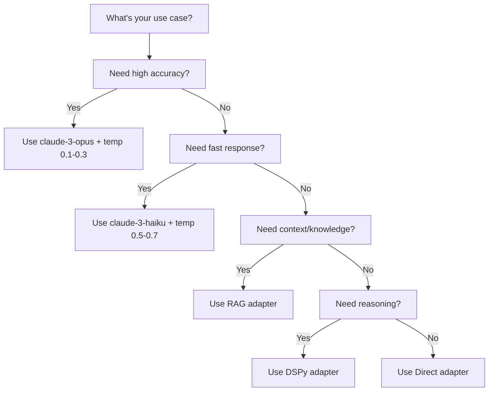

# Chat Mode Recipes & Domain Use Cases
> **Pre-configured combinations optimized for specific business domains**

## 🏦 Financial Services

### Risk Assessment Mode
```yaml
name: "RISK_ASSESSMENT"
components:
  model: "claude-3-opus"          # Highest accuracy for financial analysis
  temperature: 0.2                # Very low - need consistency
  adapter: "RAG + Gateway"         # Pull historical data + policies
  pipeline:
    - Retrieve risk policies
    - Extract financial entities
    - Apply regulatory rules
    - Calculate risk scores
    - Generate assessment
  output: "Structured risk report"
  context_sources:
    - Risk management policies
    - Historical incident database
    - Regulatory compliance docs
use_cases:
  - Credit risk evaluation
  - Market risk analysis
  - Operational risk assessment
  - Compliance risk scoring
```

### Audit Trail Mode
```yaml
name: "AUDIT_COMPLIANCE"
components:
  model: "claude-3-haiku"          # Fast, cost-effective for high volume
  temperature: 0.0                # Deterministic for audit consistency
  adapter: "Direct Gateway"        # All calls tracked and logged
  pipeline:
    - Log request with timestamp
    - Process with full traceability
    - Generate immutable response
    - Archive for compliance
  output: "Timestamped, signed response"
  features:
    - Full request/response logging
    - Cryptographic signatures
    - Regulatory timestamps
use_cases:
  - Transaction verification
  - Compliance checking
  - Regulatory reporting
  - Internal audit queries
```

### Trading Assistant Mode
```yaml
name: "TRADING_INSIGHTS"
components:
  model: "claude-3-sonnet"         # Balance of speed and quality
  temperature: 0.4                # Some creativity for insights
  adapter: "RAG + Real-time feeds"
  pipeline:
    - Pull market data
    - Analyze trends
    - Apply trading strategies
    - Generate recommendations
  output: "Actionable insights with confidence scores"
  real_time_data:
    - Market prices
    - News sentiment
    - Technical indicators
use_cases:
  - Market analysis
  - Trade recommendations
  - Portfolio optimization
  - Risk alerts
```

---

## 🏥 Healthcare

### Clinical Decision Support
```yaml
name: "CLINICAL_SUPPORT"
components:
  model: "claude-3-opus"           # Maximum accuracy for medical
  temperature: 0.3                # Conservative for safety
  adapter: "RAG + Medical KB"
  pipeline:
    - Retrieve medical literature
    - Extract symptoms/conditions
    - Apply clinical guidelines
    - Check drug interactions
    - Generate recommendations
  output: "Evidence-based recommendations with citations"
  knowledge_bases:
    - Medical literature database
    - Clinical guidelines
    - Drug interaction database
    - Patient history (HIPAA compliant)
use_cases:
  - Diagnosis assistance
  - Treatment recommendations
  - Drug interaction checking
  - Clinical trial matching
```

### Patient Communication Mode
```yaml
name: "PATIENT_FRIENDLY"
components:
  model: "claude-3-haiku"          # Fast for interactive chat
  temperature: 0.7                # Warmer, more conversational
  adapter: "Direct + Simplification"
  pipeline:
    - Simplify medical terms
    - Add empathetic framing
    - Include visual analogies
    - Provide clear next steps
  output: "Plain language explanation"
  features:
    - Medical jargon translation
    - Empathetic tone
    - Reading level adjustment
use_cases:
  - Patient education
  - Appointment scheduling
  - Medication reminders
  - Health tips
```

---

## 📚 Legal

### Contract Analysis Mode
```yaml
name: "CONTRACT_ANALYZER"
components:
  model: "claude-3-opus"           # Deep understanding needed
  temperature: 0.1                # Precise interpretation
  adapter: "RAG + Legal DB"
  pipeline:
    - Extract contract clauses
    - Identify key terms
    - Check against precedents
    - Flag potential issues
    - Generate summary
  output: "Structured analysis with risk flags"
  specialized_features:
    - Clause extraction
    - Risk identification
    - Precedent matching
    - Obligation tracking
use_cases:
  - Contract review
  - Due diligence
  - Compliance verification
  - Risk assessment
```

### Legal Research Mode
```yaml
name: "LEGAL_RESEARCH"
components:
  model: "claude-3-sonnet"
  temperature: 0.3
  adapter: "RAG + Case Law DB"
  pipeline:
    - Parse legal query
    - Search case law
    - Find relevant statutes
    - Analyze precedents
    - Synthesize findings
  output: "Research memo with citations"
  databases:
    - Case law repository
    - Statutory database
    - Regulatory filings
    - Legal journals
use_cases:
  - Case research
  - Precedent analysis
  - Statutory interpretation
  - Brief preparation
```

---

## 🎓 Education

### Socratic Tutor Mode
```yaml
name: "SOCRATIC_TUTOR"
components:
  model: "claude-3-sonnet"
  temperature: 0.6                # Balanced for learning
  adapter: "DSPy + Chain of Thought"
  pipeline:
    - Analyze student question
    - Generate guiding questions
    - Provide hints, not answers
    - Encourage exploration
    - Validate understanding
  output: "Interactive guidance"
  pedagogical_features:
    - Question-based learning
    - Progressive hints
    - Concept scaffolding
    - Understanding checks
use_cases:
  - Homework help
  - Concept exploration
  - Problem-solving guidance
  - Critical thinking development
```

### Exam Prep Mode
```yaml
name: "EXAM_PREPARATION"
components:
  model: "claude-3-haiku"          # Fast for practice questions
  temperature: 0.4
  adapter: "RAG + Question Bank"
  pipeline:
    - Generate practice questions
    - Provide worked solutions
    - Identify weak areas
    - Suggest study topics
    - Track progress
  output: "Questions with detailed explanations"
  features:
    - Adaptive difficulty
    - Topic coverage tracking
    - Performance analytics
use_cases:
  - Practice tests
  - Concept review
  - Weakness identification
  - Study planning
```

---

## 💻 Software Development

### Code Review Mode
```yaml
name: "CODE_REVIEWER"
components:
  model: "claude-3-opus"
  temperature: 0.3                # Consistent standards
  adapter: "Direct + Code Analysis"
  pipeline:
    - Parse code structure
    - Check style guidelines
    - Identify bugs/vulnerabilities
    - Suggest optimizations
    - Generate review comments
  output: "Detailed code review with suggestions"
  analysis_features:
    - Security scanning
    - Performance analysis
    - Best practice checks
    - Refactoring suggestions
use_cases:
  - PR reviews
  - Code quality checks
  - Security audits
  - Performance optimization
```

### Debug Assistant Mode
```yaml
name: "DEBUG_HELPER"
components:
  model: "claude-3-sonnet"
  temperature: 0.5
  adapter: "DSPy + Reasoning"
  pipeline:
    - Analyze error message
    - Trace execution path
    - Identify root cause
    - Suggest fixes
    - Explain the issue
  output: "Step-by-step debugging guide"
  debugging_features:
    - Error analysis
    - Stack trace interpretation
    - Root cause analysis
    - Fix suggestions
use_cases:
  - Bug diagnosis
  - Error resolution
  - Performance issues
  - Integration problems
```

### Documentation Generator
```yaml
name: "DOC_GENERATOR"
components:
  model: "claude-3-haiku"          # Fast for bulk generation
  temperature: 0.4
  adapter: "Direct + Templates"
  pipeline:
    - Analyze code structure
    - Extract functionality
    - Generate descriptions
    - Add examples
    - Format documentation
  output: "Formatted documentation"
  doc_types:
    - API documentation
    - README files
    - Code comments
    - User guides
use_cases:
  - API docs
  - Function documentation
  - README generation
  - Tutorial creation
```

---

## 🏢 Business Operations

### Customer Service Mode
```yaml
name: "CUSTOMER_SUPPORT"
components:
  model: "claude-3-haiku"
  temperature: 0.7                # Friendly, conversational
  adapter: "RAG + CRM Integration"
  pipeline:
    - Retrieve customer history
    - Understand issue
    - Apply support policies
    - Generate solution
    - Log interaction
  output: "Helpful response with next steps"
  integrations:
    - CRM system
    - Knowledge base
    - Ticket system
    - FAQ database
use_cases:
  - Customer inquiries
  - Technical support
  - Order assistance
  - Complaint resolution
```

### Strategic Planning Mode
```yaml
name: "STRATEGIC_ADVISOR"
components:
  model: "claude-3-opus"
  temperature: 0.6                # Creative insights
  adapter: "HYBRID"               # Best mode selected per query
  pipeline:
    - Analyze market data
    - Review competitors
    - Identify opportunities
    - Generate strategies
    - Risk assessment
  output: "Strategic recommendations with analysis"
  data_sources:
    - Market research
    - Competitor analysis
    - Industry trends
    - Internal metrics
use_cases:
  - Business strategy
  - Market analysis
  - Competitive intelligence
  - Growth planning
```

### Meeting Assistant Mode
```yaml
name: "MEETING_HELPER"
components:
  model: "claude-3-haiku"
  temperature: 0.5
  adapter: "Direct + Summarization"
  pipeline:
    - Transcribe/process notes
    - Extract key points
    - Identify action items
    - Generate summary
    - Create follow-ups
  output: "Meeting summary with action items"
  features:
    - Real-time transcription
    - Action item extraction
    - Decision tracking
    - Follow-up generation
use_cases:
  - Meeting minutes
  - Action tracking
  - Decision documentation
  - Follow-up coordination
```

---

## 🔬 Research & Analytics

### Literature Review Mode
```yaml
name: "LITERATURE_REVIEW"
components:
  model: "claude-3-opus"
  temperature: 0.4
  adapter: "RAG + Academic DB"
  pipeline:
    - Search academic papers
    - Extract key findings
    - Identify trends
    - Synthesize knowledge
    - Generate citations
  output: "Comprehensive literature review"
  academic_features:
    - Citation generation
    - Trend analysis
    - Gap identification
    - Methodology comparison
use_cases:
  - Research papers
  - Grant proposals
  - Thesis work
  - Systematic reviews
```

### Data Analysis Mode
```yaml
name: "DATA_ANALYST"
components:
  model: "claude-3-sonnet"
  temperature: 0.3                # Accurate analysis
  adapter: "Direct + Computation"
  pipeline:
    - Understand data query
    - Suggest analysis methods
    - Interpret results
    - Identify patterns
    - Generate insights
  output: "Analysis with visualizations"
  analytical_features:
    - Statistical analysis
    - Pattern recognition
    - Anomaly detection
    - Predictive insights
use_cases:
  - Data exploration
  - Statistical analysis
  - Report generation
  - Insight discovery
```

---

## 🎯 Suggested Combinations for Common Scenarios

### Quick Decision Tree



### Temperature Guidelines by Domain

| Domain | Recommended Temperature | Reasoning |
|--------|------------------------|-----------|
| Financial/Legal | 0.0 - 0.3 | Accuracy and consistency critical |
| Healthcare | 0.2 - 0.4 | Safety and reliability important |
| Customer Service | 0.6 - 0.8 | Natural, friendly conversation |
| Creative/Marketing | 0.7 - 0.9 | Innovation and creativity valued |
| Technical/Engineering | 0.3 - 0.5 | Balance accuracy with problem-solving |
| Education | 0.4 - 0.6 | Adaptive to student needs |

### Model Selection Matrix

| Requirement | Best Model | Why |
|-------------|------------|-----|
| Highest accuracy | claude-3-opus | Most capable, deepest understanding |
| Best value | claude-3-sonnet | Great balance of cost/performance |
| High volume | claude-3-haiku | Fastest and most economical |
| Complex reasoning | claude-3-opus | Best at multi-step logic |
| Real-time chat | claude-3-haiku | Lowest latency |
| Document analysis | claude-3-sonnet | Good balance for long contexts |

---

## 💡 Creating Your Own Domain Mode

### Template
```yaml
name: "YOUR_DOMAIN_MODE"
components:
  model: "claude-3-[haiku|sonnet|opus]"
  temperature: 0.0-1.0
  adapter: "[Direct|RAG|DSPy|Hybrid]"
  pipeline:
    - Step 1
    - Step 2
    - Step 3
  output: "Format description"
  special_features:
    - Feature 1
    - Feature 2
use_cases:
    - Use case 1
    - Use case 2
```

### Best Practices
1. **Start with existing mode** - Modify a similar domain's configuration
2. **Test temperature** - Try different values to find optimal balance
3. **Measure performance** - Track response time, cost, and quality
4. **Iterate based on feedback** - Adjust based on user needs
5. **Document your mode** - Help others understand and use it

---

*These recipes are starting points - adjust based on your specific requirements and constraints.*