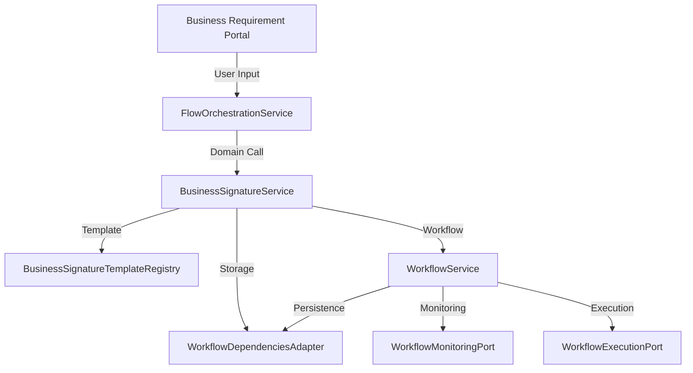

# Business Signature System - Technical Architecture

## Architectural Overview

The Business Signature System implements a domain-driven hexagonal architecture that prioritizes business requirements over technical implementation details. The system answers "Is it the business requirements or the process?" by firmly establishing business requirements as the driving force.

## Architecture Layers

### 1. Domain Layer (Core Business Logic)

```
domain/
├── services/
│   ├── business_signature_service.py    # Core business signature logic
│   └── workflow_service.py              # Enhanced workflow domain service
├── templates/
│   └── business_signature_templates.py  # Domain-specific business patterns
└── ports/
    └── outbound/
        └── workflow_port.py              # Domain interfaces and contracts
```

**Responsibilities:**
- Pure business logic without infrastructure dependencies
- Domain vocabulary and business concept modeling
- Business requirement capture and validation
- Signature generation from business patterns
- Business rule enforcement and validation

**Key Components:**

#### BusinessSignatureService
```python
class BusinessSignatureService:
    def capture_business_requirement() -> BusinessRequirement
    def generate_business_signature() -> BusinessSignature
    def deploy_business_signature_as_tool() -> Dict[str, Any]
    def validate_business_signature() -> Dict[str, Any]
```

#### Business Domain Models
```python
@dataclass
class BusinessRequirement:
    requirement_id: str
    requirement_type: BusinessRequirementType
    business_context: BusinessContext
    business_question: str
    domain_vocabulary: Dict[str, str]
    success_criteria: List[str]
    business_rules: List[Dict[str, Any]]

@dataclass
class BusinessSignature:
    signature_id: str
    business_requirement: BusinessRequirement
    signature_name: str
    business_purpose: str
    domain_inputs: Dict[str, str]
    domain_outputs: Dict[str, str]
    signature_template: str
```

### 2. Application Layer (Orchestration)

```
packages/tidyllm/services/
└── flow_orchestration_service.py        # Application service integration
```

**Responsibilities:**
- Orchestrates domain services
- Manages workflow integration
- Provides backward compatibility
- Handles cross-cutting concerns

**Key Integration Points:**
```python
class FlowOrchestrationService:
    def get_available_flow_macros() -> List[Dict[str, Any]]
    def execute_business_tool_macro() -> Dict[str, Any]
    def list_business_signature_tools() -> List[Dict[str, Any]]
    def create_business_signature_workflow() -> Dict[str, Any]
```

### 3. Infrastructure Layer (Technical Implementation)

```
adapters/secondary/workflow/
└── workflow_dependencies_adapter.py     # Infrastructure integration
```

**Responsibilities:**
- Database and storage operations
- External system integrations
- Technical infrastructure concerns
- Dependency injection implementation

### 4. Portal Layer (User Interface)

```
portals/flow/
└── business_requirement_portal.py       # Business requirement capture UI
```

**Responsibilities:**
- Business stakeholder interaction
- Requirement capture workflows
- Signature management interfaces
- Business validation and approval

## Design Patterns

### Hexagonal Architecture (Ports and Adapters)

```
┌─────────────────────────────────────┐
│              Portal Layer           │
│        (User Interfaces)           │
└─────────────┬───────────────────────┘
              │
┌─────────────▼───────────────────────┐
│         Application Layer           │
│      (FlowOrchestrationService)    │
└─────────────┬───────────────────────┘
              │
┌─────────────▼───────────────────────┐
│           Domain Layer              │
│    (BusinessSignatureService)      │
│        (WorkflowService)           │
└─────────────┬───────────────────────┘
              │
┌─────────────▼───────────────────────┐
│       Infrastructure Layer          │
│    (WorkflowDependenciesAdapter)   │
└─────────────────────────────────────┘
```

### Domain-Driven Design Principles

1. **Ubiquitous Language**: Business vocabulary consistently used throughout
2. **Bounded Contexts**: Clear domain boundaries for different business areas
3. **Domain Services**: Business logic encapsulated in domain services
4. **Value Objects**: Immutable business concepts (BusinessRequirement, BusinessSignature)
5. **Entities**: Business objects with identity and lifecycle

### Dependency Injection

```python
# Domain service depends on ports (interfaces)
class BusinessSignatureService:
    def __init__(self, dependencies: WorkflowDependenciesPort):
        self.dependencies = dependencies

# Infrastructure provides implementations
class WorkflowDependenciesAdapter(WorkflowDependenciesPort):
    def get_storage_service(self) -> WorkflowStoragePort:
        return WorkflowStorageAdapter()
```

## Data Flow

### 1. Business Requirement Capture Flow

```
Business Stakeholder
        ↓
Business Requirement Portal
        ↓ (User Input)
BusinessSignatureService.capture_business_requirement()
        ↓ (Domain Processing)
BusinessRequirement (Value Object)
        ↓ (Storage)
WorkflowStoragePort.save_workflow()
```

### 2. Signature Generation Flow

```
BusinessRequirement
        ↓
BusinessSignatureService.generate_business_signature()
        ↓ (Template Selection)
BusinessSignatureTemplateRegistry.get_template()
        ↓ (Code Generation)
DSPy Signature Template
        ↓ (Domain Enhancement)
BusinessSignature (Value Object)
        ↓ (Storage)
WorkflowStoragePort.save_workflow()
```

### 3. Tool Deployment Flow

```
BusinessSignature
        ↓
BusinessSignatureService.deploy_business_signature_as_tool()
        ↓ (Registration)
WorkflowRegistryPort.save_workflow_template()
        ↓ (Integration)
FlowOrchestrationService.get_available_flow_macros()
        ↓ (Availability)
Business Tool in Flow Macros
```

### 4. Execution Flow

```
Flow Macro: [BUSINESS_TOOL:signature_id]
        ↓
FlowOrchestrationService.execute_business_tool_macro()
        ↓ (Domain Delegation)
WorkflowService.execute_business_tool_macro()
        ↓ (Workflow Creation)
WorkflowService.create_business_signature_workflow()
        ↓ (Execution)
DSPy Signature Execution
        ↓ (Business Results)
Business Output with Domain Context
```

## Component Interactions

### Cross-Layer Communication



### Domain Service Dependencies

```python
class BusinessSignatureService:
    def __init__(self, dependencies: WorkflowDependenciesPort):
        # Injected dependencies provide access to:
        self.storage = dependencies.get_storage_service()
        self.registry = dependencies.get_registry_service()
        self.monitoring = dependencies.get_monitoring_service()
```

## Business Domain Modeling

### Business Context Enumeration

```python
class BusinessContext(Enum):
    FINANCIAL_ANALYSIS = "financial_analysis"
    CONTRACT_REVIEW = "contract_review"
    COMPLIANCE_CHECK = "compliance_check"
    QUALITY_ASSURANCE = "quality_assurance"
    RISK_ASSESSMENT = "risk_assessment"
    DOCUMENT_PROCESSING = "document_processing"
    CUSTOMER_SERVICE = "customer_service"
    OPERATIONAL_WORKFLOW = "operational_workflow"
```

### Business Requirement Types

```python
class BusinessRequirementType(Enum):
    DECISION_PROCESS = "decision_process"
    VALIDATION_RULE = "validation_rule"
    TRANSFORMATION = "transformation"
    ANALYSIS_PATTERN = "analysis_pattern"
    APPROVAL_FLOW = "approval_flow"
    EXTRACTION_RULE = "extraction_rule"
    CLASSIFICATION = "classification"
    SYNTHESIS = "synthesis"
```

### Domain Template Structure

```python
@dataclass
class DomainSignatureTemplate:
    template_id: str
    domain_context: BusinessContext
    requirement_type: BusinessRequirementType
    business_pattern_name: str
    domain_vocabulary: Dict[str, str]
    signature_structure: Dict[str, Any]
    business_logic_template: str
    validation_patterns: List[str]
    success_metrics: List[str]
    stakeholder_considerations: List[str]
```

## Integration Points

### Flow Macro System Integration

The system extends the existing Flow Macro system to include business signatures:

```python
# Enhanced Flow Macro List
def get_available_flow_macros(self) -> List[Dict[str, Any]]:
    standard_macros = self.workflow_service.get_available_flow_macros()
    business_tools = self.workflow_service.list_business_signature_tools()

    # Convert business tools to flow macro format
    business_macros = []
    for tool in business_tools:
        business_macros.append({
            "name": f"BUSINESS_TOOL:{tool.get('signature_id')}",
            "description": f"{tool.get('business_name')} - {tool.get('business_purpose')}",
            "type": "business_signature",
            "business_context": tool.get('business_context'),
            "input_schema": tool.get('input_schema'),
            "output_schema": tool.get('output_schema')
        })

    return standard_macros + business_macros
```

### Workflow System Integration

Business signatures integrate as first-class workflow citizens:

```python
def create_business_signature_workflow(self, signature_id: str, business_inputs: Dict[str, Any]):
    # Load business signature configuration
    signature_data = storage_service.load_workflow(f"business_sig_{signature_id}")

    # Create workflow configuration
    workflow_config = {
        "workflow_type": "business_signature",
        "signature_id": signature_id,
        "business_name": signature_data.get("signature_name"),
        "business_inputs": business_inputs,
        "signature_template": signature_data.get("signature_template"),
        "validation_rules": signature_data.get("validation_rules"),
        "business_context": signature_data.get("business_requirement", {}).get("business_context")
    }

    # Create, deploy, and execute workflow
    result = self.create_workflow(WorkflowSystemType.CUSTOM_WORKFLOW, workflow_config)
    if result.get("success"):
        deploy_result = self.deploy_workflow(result.get("workflow_id"))
        if deploy_result.get("success"):
            return self.execute_workflow(result.get("workflow_id"), business_inputs)
```

## Extensibility Points

### Adding New Business Domains

1. **Extend BusinessContext enum**:
```python
class BusinessContext(Enum):
    # Existing contexts...
    NEW_BUSINESS_DOMAIN = "new_business_domain"
```

2. **Create domain templates**:
```python
def _create_new_domain_templates(self) -> Dict[str, DomainSignatureTemplate]:
    templates = {}
    templates["new_domain_pattern"] = DomainSignatureTemplate(
        # Template configuration...
    )
    return templates
```

3. **Add domain vocabulary**:
```python
"new_business_domain": {
    "domain_term": "Business definition of domain term",
    "business_concept": "Business meaning of concept"
}
```

### Adding New Requirement Types

1. **Extend BusinessRequirementType enum**
2. **Create business patterns for new requirement type**
3. **Update template registry with new patterns**

### Custom Business Validation

```python
def _create_custom_validation_rules(self, requirement: BusinessRequirement) -> List[str]:
    # Custom business validation logic
    rules = []
    if requirement.business_context == BusinessContext.CUSTOM_DOMAIN:
        # Add domain-specific validation rules
        rules.append("Custom business validation rule")
    return rules
```

## Performance Considerations

### Caching Strategy

```python
# Template caching
@lru_cache(maxsize=128)
def get_template(self, template_id: str) -> Optional[DomainSignatureTemplate]:
    return self.templates.get(template_id)

# Business vocabulary caching
@property
@lru_cache(maxsize=64)
def business_vocabulary(self) -> Dict[str, Dict[str, str]]:
    return self._load_business_vocabulary()
```

### Lazy Loading

```python
# Load templates on demand
def _initialize_domain_templates(self) -> Dict[str, DomainSignatureTemplate]:
    if not hasattr(self, '_templates_cache'):
        self._templates_cache = self._load_all_templates()
    return self._templates_cache
```

### Asynchronous Processing

```python
async def generate_business_signature_async(
    self, requirement: BusinessRequirement
) -> BusinessSignature:
    # Asynchronous signature generation for large templates
    return await asyncio.create_task(
        self._generate_signature_task(requirement)
    )
```

## Security Considerations

### Business Data Protection

```python
def capture_business_requirement(self, stakeholder_input: Dict[str, Any]):
    # Sanitize business input
    sanitized_input = self._sanitize_business_input(stakeholder_input)

    # Validate business permissions
    if not self._validate_business_access(stakeholder_input):
        raise BusinessAccessDeniedError("Insufficient business permissions")
```

### Domain Isolation

```python
# Each business context is isolated
def get_domain_vocabulary(self, business_context: BusinessContext) -> Dict[str, str]:
    # Only return vocabulary for authorized business context
    if not self._is_authorized_for_context(business_context):
        return {}
    return self.business_vocabulary.get(business_context.value, {})
```

### Audit Trail

```python
def log_business_signature_event(self, event_type: str, event_data: Dict[str, Any]):
    monitoring_service.log_workflow_event(
        workflow_id=event_data.get("signature_id"),
        event_type=f"business_signature_{event_type}",
        event_data={
            **event_data,
            "timestamp": datetime.now().isoformat(),
            "user_context": self._get_business_user_context()
        }
    )
```

## Monitoring and Observability

### Business Metrics

```python
def get_business_signature_metrics(self) -> Dict[str, Any]:
    return {
        "total_requirements_captured": self._count_business_requirements(),
        "signatures_generated": self._count_generated_signatures(),
        "business_tools_deployed": self._count_deployed_tools(),
        "stakeholder_satisfaction": self._get_satisfaction_score(),
        "domain_coverage": self._get_domain_coverage(),
        "business_success_rate": self._get_business_success_rate()
    }
```

### Performance Monitoring

```python
@monitor_performance
def generate_business_signature(self, requirement: BusinessRequirement):
    with BusinessSignatureMetrics.timer('signature_generation'):
        return self._generate_signature_internal(requirement)
```

### Health Checks

```python
def business_signature_health_check(self) -> Dict[str, Any]:
    return {
        "template_registry_healthy": self._check_template_registry(),
        "business_vocabulary_loaded": self._check_vocabulary_availability(),
        "domain_services_available": self._check_domain_services(),
        "workflow_integration_healthy": self._check_workflow_integration()
    }
```

## Testing Strategy

### Domain Logic Testing

```python
def test_business_requirement_capture():
    # Test business requirement capture with domain data
    service = BusinessSignatureService(mock_dependencies)
    requirement = service.capture_business_requirement(
        business_question="Test business question",
        requirement_type=BusinessRequirementType.ANALYSIS_PATTERN,
        business_context=BusinessContext.FINANCIAL_ANALYSIS,
        stakeholder_input=test_business_input
    )
    assert requirement.business_question == "Test business question"
```

### Integration Testing

```python
def test_flow_macro_integration():
    # Test end-to-end business signature execution
    orchestration_service = FlowOrchestrationService()
    result = orchestration_service.execute_business_tool_macro(
        "financial_health_assessment",
        {"financial_statements": "test_data.pdf"}
    )
    assert result["success"] is True
```

### Business Scenario Testing

```python
def test_financial_analysis_business_scenario():
    # Test realistic business scenario
    template = template_registry.get_template("financial_health_assessment")
    test_scenarios = template.test_scenarios

    for scenario in test_scenarios:
        result = execute_business_signature(
            template.template_id,
            scenario["test_inputs"]
        )
        assert meets_business_expectations(result, scenario["expected_outcomes"])
```

## Deployment Architecture

### Development Environment

```yaml
services:
  business-signature-portal:
    image: streamlit-portal
    ports:
      - "8512:8512"
    environment:
      - DOMAIN_SERVICES_ENABLED=true

  workflow-service:
    image: workflow-domain-service
    environment:
      - BUSINESS_SIGNATURES_ENABLED=true
```

### Production Considerations

1. **Scalability**: Domain services can be scaled independently
2. **Availability**: Business signature templates cached for high availability
3. **Performance**: Asynchronous signature generation for large workflows
4. **Monitoring**: Comprehensive business and technical metrics
5. **Security**: Business data encryption and access controls

This technical architecture enables the Business Signature System to serve as a bridge between business requirements and technical implementation while maintaining clean separation of concerns and supporting the organization's domain-driven development goals.