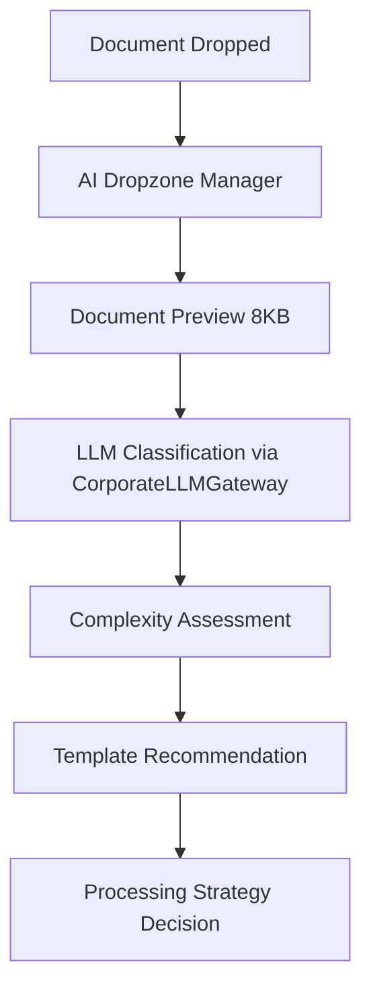
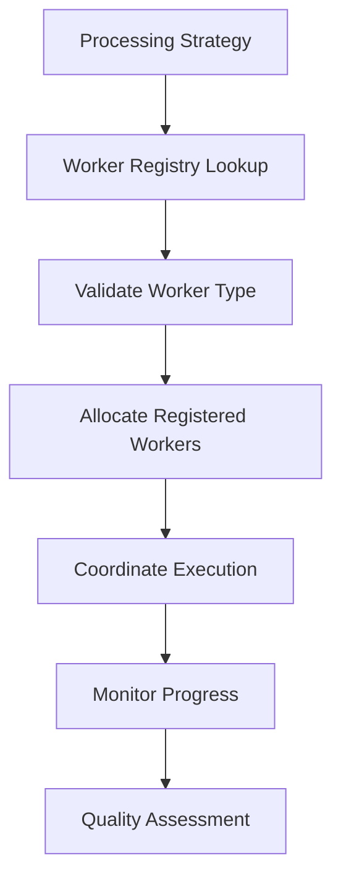
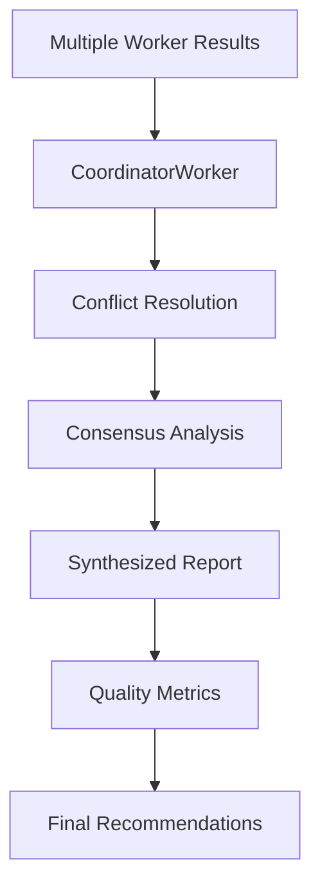

# TidyLLM Infrastructure Workers Documentation

## AI Dropzone Manager Architecture

### Overview
The AI Dropzone Manager is a security-hardened orchestration layer that intelligently manages document processing in drop zones. It serves as the central coordinator for document intelligence, template selection, and worker allocation while maintaining strict security boundaries.

### Core Components

#### 1. AI Dropzone Manager (`ai_dropzone_manager.py`)
**Purpose**: Intelligent orchestration of document processing workflows in drop zones

**Key Features**:
- Document type classification via CorporateLLMGateway
- Complexity assessment and processing strategy recommendation  
- Template selection from approved library
- Worker allocation from registered pool only
- Quality monitoring and performance feedback

#### 2. Worker Types
- **PromptWorker**: Executes template-based document analysis
- **FlowRecoveryWorker**: Handles stuck/failed document recovery
- **CoordinatorWorker**: Synthesizes multi-template analysis results
- **BaseWorker**: Abstract base class for all worker implementations

#### 3. Supporting Components
- **Manager API** (`manager_endpoints.py`): REST endpoints for external integration
- **Manager CLI** (`ai_manager_commands.py`): Command-line interface for operations
- **Template Library**: Pre-validated processing templates in `prompts/templates/`

### Security Architecture

#### Critical Security Constraints

**🔒 WORKER REGISTRY ONLY**
```python
# APPROVED WORKERS ONLY - No dynamic worker creation
approved_worker_types = {
    "PromptWorker": PromptWorker,
    "FlowRecoveryWorker": FlowRecoveryWorker, 
    "CoordinatorWorker": CoordinatorWorker
}
```

**🔒 ORCHESTRATION BOUNDARY**
- AI Manager decides **WHICH** workers to use
- Workers execute **WHAT** functions they perform
- No execution of arbitrary prompts or code generation by AI Manager

**🔒 LLM GATEWAY ENFORCEMENT**
```python
# ALL AI calls must go through CorporateLLMGateway
request = LLMRequest(
    prompt=classification_prompt,
    model="claude-3-haiku",
    audit_reason="AI Manager document classification",
    user_id="ai_manager_system"
)
response = self.llm_gateway.process_llm_request(request)
```

**🔒 TEMPLATE VALIDATION**
```python
def _validate_template_path(self, template_path: str) -> bool:
    """Validate template is from approved directory only."""
    template_file = Path(template_path)
    templates_dir = Path(self.templates_path).resolve()
    
    # Check if template is within approved directory
    if not template_file.resolve().is_relative_to(templates_dir):
        logger.warning(f"[SECURITY] Template outside approved directory rejected")
        return False
```

**🔒 LIMITED FILE ACCESS**
- Document analysis limited to first 8KB preview
- No direct file system access beyond metadata
- Workers handle full document processing with their own security controls

**🔒 AUDIT TRAIL**
```python
audit_entry = {
    "timestamp": datetime.now().isoformat(),
    "user_id": request.user_id,
    "provider": request.provider,
    "model": request.model,
    "audit_reason": request.audit_reason,
    "cost_usd": cost,
    "compliance_status": "approved"
}
```

### Processing Flow

#### 1. Document Intelligence Analysis


#### 2. Worker Orchestration


#### 3. Result Synthesis


### API Integration

#### REST Endpoints
```http
POST /api/v1/process
GET /api/v1/process/{processing_id}
GET /api/v1/process/{processing_id}/result
GET /api/v1/manager/status
GET /api/v1/process/{processing_id}/stream
```

#### MCP Integration
```json
{
  "tool": "ai_manager_process",
  "parameters": {
    "document_path": "/path/to/document.pdf",
    "business_priority": "high",
    "templates": ["financial_analysis", "compliance_review"]
  }
}
```

#### CLI Commands
```bash
# Process document with AI intelligence
tidyllm ai-manager process /path/doc.pdf --priority critical --watch

# Analyze document without processing
tidyllm ai-manager analyze /path/doc.pdf

# Monitor system status
tidyllm ai-manager status

# List available templates
tidyllm ai-manager templates --detailed
```

### Template System

#### Template Structure
```markdown
# Template Name
*Description and purpose*

## Stage 1: Analysis
```
Prompt for initial analysis with {document_content} placeholder
```

## Stage 2: Processing  
```
Detailed processing prompt with structured output requirements
```

## Stage 3: Validation
```
Quality validation and recommendation generation
```
```

#### Available Templates
- **financial_analysis.md**: Financial document analysis and risk assessment
- **contract_analysis.md**: Legal contract review and compliance checking
- **compliance_review.md**: Regulatory compliance analysis
- **qa_control.md**: Quality assurance review workflows
- **data_extraction.md**: Structured data extraction and validation
- **peer_review.md**: Expert peer review and validation
- **hybrid_analysis.md**: Multi-framework analytical synthesis

### Worker Configuration

#### Worker Registration
```python
# Register approved worker with validation
manager.register_worker(
    worker_id="prompt_worker_001",
    worker_type="PromptWorker",
    templates_path="/approved/templates/path",
    llm_gateway=corporate_llm_gateway
)
```

#### Worker Allocation
```python
worker_assignments = await manager._allocate_workers(
    strategy=ProcessingStrategy.HYBRID_ANALYSIS,
    intelligence=document_intelligence
)
```

### Quality Monitoring

#### Performance Metrics
```python
quality_metrics = {
    "expected_accuracy": 0.85,
    "expected_completeness": 0.90, 
    "confidence_threshold": 0.80,
    "processing_time_limit": 1.2  # Multiplier of estimated time
}
```

#### Feedback Loop
```python
await manager.update_quality_feedback(
    document_path="/path/to/doc.pdf",
    quality_metrics={
        "accuracy": 0.92,
        "completeness": 0.88,
        "user_satisfaction": 0.85
    }
)
```

### Deployment Architecture

#### Component Dependencies
```
AI Dropzone Manager
├── CorporateLLMGateway (REQUIRED)
├── UnifiedSessionManager
├── Template Library (prompts/templates/)
├── Registered Workers
│   ├── PromptWorker
│   ├── FlowRecoveryWorker
│   └── CoordinatorWorker
└── Infrastructure
    ├── ConfigManager
    ├── Logging
    └── Audit Trail
```

#### Initialization Sequence
1. Validate worker registry security
2. Load and validate template library
3. Initialize CorporateLLMGateway connection
4. Register approved worker instances
5. Load historical performance data
6. Validate all security constraints
7. Start orchestration services

### Security Considerations

#### Threat Mitigation
- **Code Injection**: Worker registry prevents arbitrary code execution
- **Template Injection**: Path validation ensures only approved templates
- **LLM Bypass**: All AI calls routed through CorporateLLMGateway
- **Data Exposure**: Limited document previews, no full file access
- **Audit Evasion**: Comprehensive logging of all operations

#### Compliance Features
- Budget controls via CorporateLLMGateway
- Audit reason required for all LLM requests
- PII detection and masking
- Regulatory compliance validation
- Cost tracking and reporting

### Extension Points

#### Future Manager Types
- **AI Batch Manager**: Handle large-scale batch processing
- **AI API Manager**: Manage real-time API document processing  
- **AI Workflow Manager**: Orchestrate complex multi-stage workflows
- **AI Compliance Manager**: Specialized regulatory compliance processing

#### Worker Extensions
- **ValidationWorker**: Specialized validation and verification
- **TransformationWorker**: Document format conversion and transformation
- **IndexingWorker**: Document indexing and search preparation
- **NotificationWorker**: Result delivery and stakeholder communication

### Monitoring and Alerting

#### Health Checks
```python
status = await manager.get_manager_status()
# Returns: active_workers, queue_length, performance_metrics, system_resources
```

#### Performance Monitoring
- Processing time per document type
- Template selection accuracy
- Worker utilization rates
- Quality score trends
- Cost per processing operation

#### Alerting Thresholds
- Queue backup beyond capacity
- Processing failures above threshold
- Quality scores below acceptable levels
- Budget limits approaching

### Troubleshooting Guide

#### Common Issues
1. **Worker Registration Failures**: Check approved_worker_types registry
2. **Template Loading Errors**: Validate template directory permissions
3. **LLM Gateway Unavailable**: Verify CorporateLLMGateway connection
4. **Processing Stuck**: Check FlowRecoveryWorker operation
5. **Quality Degradation**: Review template performance metrics

#### Debug Commands
```bash
# Check system status
tidyllm ai-manager status

# Monitor processing queue  
tidyllm ai-manager queue

# Validate worker health
tidyllm ai-manager workers

# Test document analysis
tidyllm ai-manager analyze /path/to/test/doc.pdf
```

### Best Practices

#### Security Best Practices
- Regularly audit worker registry for unauthorized additions
- Monitor template library for unauthorized modifications
- Review LLM Gateway audit logs for suspicious patterns
- Validate processing costs against budgets
- Test recovery procedures for stuck documents

#### Performance Optimization
- Pre-register workers during initialization
- Cache document intelligence for similar documents
- Use appropriate LLM models for classification (fast) vs analysis (accurate)
- Monitor and tune quality thresholds based on business requirements
- Implement load balancing across worker pools

#### Operational Excellence
- Maintain comprehensive documentation of approved templates
- Establish clear escalation procedures for failed processing
- Implement automated quality monitoring and alerting
- Regular security reviews of worker implementations
- Performance testing under expected load conditions