# TidyLLM Business Architecture

## Current Gateway Flow Architecture

```mermaid
flowchart LR
    A("tidyllm.chat('Analyze quarterly risk metrics')") --> B["<b>BusinessContextGateway</b><br/>Determines compliance rules<br/>• GDPR requirements<br/>• Financial regulations<br/>• Industry standards"]
    B --> C["<b>WorkflowSolutionGateway</b><br/>Selects appropriate workflow<br/>• Risk analysis pipeline<br/>• Compliance reporting<br/>• Data validation steps"]
    C --> D["<b>AIProcessingGateway</b><br/>Optimizes prompt for context<br/>• Adds domain expertise<br/>• Injects relevant examples<br/>• Structures output format"]
    D --> E["<b>ModelExecutionGateway</b><br/>Executes with proper model<br/>• Claude for analysis<br/>• GPT for summaries<br/>• Local models for sensitive data"]
    E --> F("Structured risk assessment report")
    
    style A fill:#e1f5fe,stroke:#01579b,stroke-width:2px
    style F fill:#e8f5e8,stroke:#2e7d32,stroke-width:2px
    style B fill:#fff3e0,stroke:#ef6c00,stroke-width:2px
    style C fill:#f3e5f5,stroke:#7b1fa2,stroke-width:2px
    style D fill:#e0f2f1,stroke:#00695c,stroke-width:2px
    style E fill:#fce4ec,stroke:#c2185b,stroke-width:2px
```

## Business Value Proposition

### 1. Intelligent Gateway Orchestration
- **BusinessContextGateway**: Ensures all processing meets compliance requirements
- **WorkflowSolutionGateway**: Routes requests to optimal processing pipelines
- **AIProcessingGateway**: Enhances prompts with domain expertise
- **ModelExecutionGateway**: Selects best-fit AI models for each task

### 2. Enterprise Benefits
- **Compliance-First**: Every request automatically validated against regulations
- **Cost Optimization**: Right-sized model selection reduces processing costs
- **Quality Assurance**: Multi-stage validation ensures accurate outputs
- **Scalability**: Gateway architecture handles enterprise-scale workloads

### 3. Use Case Examples
- **Financial Analysis**: "Analyze Q3 risk metrics" → Compliance checks → Risk workflow → Domain prompts → Specialized model
- **Legal Review**: "Review contract terms" → GDPR validation → Legal workflow → Legal prompts → Claude analysis
- **Customer Support**: "Handle customer complaint" → Privacy rules → Support workflow → Empathy prompts → Response model