# MVR Analysis Flow - Technical Implementation

## MVR (Model Validation Review) Analysis Through TidyLLM Architecture

```mermaid
flowchart LR
    A("tidyllm.chat('[MVR Analysis]', documents=[<br/>  'MVR_Report.pdf',<br/>  'VS_Report.pdf'<br/>])") --> B["<h2>BusinessContext</h2>Checks compliance<br/><b>check_mrm_standards()</b><br/><b>check_mrm_procedures()</b><br/><b>check_mrm_guidance()</b><br/><b>apply_validation_framework()</b><br/><i>Context Inputs:</i><br/>Recording Items<br/>Process Status<br/>Timelines<br/>Parties Involved"]
    B --> C["<h2>WorkflowSolution</h2>Template Matching & Validation<br/><b>compare_mvr_template_report()</b><br/><b>check_scope_alignment()</b><br/><b>validate_justifications()</b><br/><b>match_toc_structure()</b><br/><b>compare_vs_template_report()</b><br/><b>track_pending_items()</b>"]
    C --> D["<h2>AIProcessing</h2>Report Analysis (3-Part)<br/><b>analyze_compliance()</b><br/><b>check_consistency()</b><br/><b>evaluate_clarity()</b><br/><b>generate_qa_healthcheck()</b><br/><b>identify_analysis_gaps()</b><br/><b>record_validation_items()</b>"]
    D --> E["<h2>ModelExecution</h2>Executes specialized analysis<br/><b>claude_risk_analysis()</b><br/><b>gpt_summary_generation()</b><br/><b>local_sensitive_data_processing()</b><br/><b>ensemble_validation_scoring()</b>"]
    E --> F("<b>Comprehensive MVR QA</b><br/>Risk assessment findings<br/>Compliance status<br/>Validation recommendations<br/>Technical implementation notes")
    E --> G("<b>Healthcheck QA</b><br/>Analysis results<br/>Pending Items<br/>Recording Item")
    
    class A userInput
    class R dataInput
    class F output
    class G qaOutput
    class B gateway1
    class C gateway2
    class D gateway3
    class E gateway4
    
    classDef userInput fill:#e3f2fd,stroke:#0277bd,stroke-width:3px
    classDef dataInput fill:#e1bee7,stroke:#6a1b9a,stroke-width:2px
    classDef output fill:#e8f5e8,stroke:#2e7d32,stroke-width:3px
    classDef qaOutput fill:#fff3e0,stroke:#ff6f00,stroke-width:3px
    classDef gateway1 fill:#fff8e1,stroke:#f57c00,stroke-width:2px
    classDef gateway2 fill:#fce4ec,stroke:#c2185b,stroke-width:2px
    classDef gateway3 fill:#e0f2f1,stroke:#00796b,stroke-width:2px
    classDef gateway4 fill:#f3e5f5,stroke:#7b1fa2,stroke-width:2px
```

## Technical Function Mapping

### BusinessContext Functions
- `check_mrm_standards()` - Checks against MRM Standards
- `check_mrm_procedures()` - Validates MRM Procedures
- `check_mrm_guidance()` - Reviews MRM Guidance
- `apply_validation_framework()` - Enforces comprehensive MRM framework
- **Context Inputs Processing:**
  - `process_recording_items()` - Ingests pre-pulled recording items
  - `check_process_status()` - Validates current process state
  - `validate_timelines()` - Ensures timeline compliance
  - `identify_parties_involved()` - Maps stakeholder responsibilities

### WorkflowSolution Functions  
- **Template Matching Layer:**
  - `compare_mvr_template_report()` - Validates MVR against template
  - `check_scope_alignment()` - In/Out scope matching
  - `validate_justifications()` - Reviews justification completeness
  - `match_toc_structure()` - Table of contents alignment
  - `compare_vs_template_report()` - Validates VS (Validation Scope) against template
  - `track_pending_items()` - Identifies incomplete sections

### AIProcessing Functions
- **Report Analysis Engine (3-Part):**
  - `analyze_compliance()` - Sectional & whole document review from markdown
  - `check_consistency()` - Cross-document validation between VS & MVR
  - `evaluate_clarity()` - Readability and completeness assessment
  - `generate_qa_healthcheck()` - Creates comprehensive QA report
  - `identify_analysis_gaps()` - Flags pending items for review
  - `record_validation_items()` - Documents recording items

### ModelExecution Functions
- `claude_risk_analysis()` - Deep qualitative risk assessment
- `gpt_summary_generation()` - Executive summary creation
- `local_sensitive_data_processing()` - Secure internal data analysis
- `ensemble_validation_scoring()` - Multi-model validation scoring

## Business Value
- **Regulatory Compliance**: Automated validation against MRM standards
- **Risk Mitigation**: Systematic model risk assessment  
- **Efficiency Gains**: Automated report generation and analysis
- **Audit Trail**: Complete documentation of validation process

## Output Descriptions

### Comprehensive MVR QA
- Risk assessment findings
- Compliance status
- Validation recommendations
- Technical implementation notes

### Healthcheck QA
- Analysis results
- Pending Items
- Recording Item