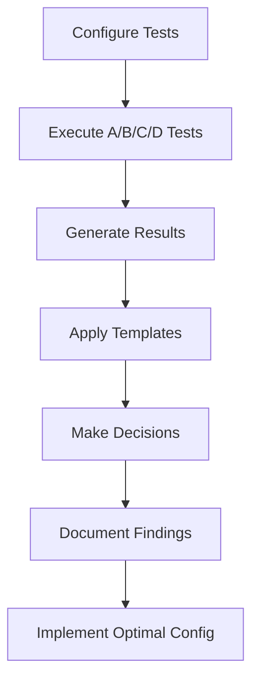

# TidyLLM Test Templates Library
*Comprehensive testing templates for workflow optimization and validation*

---

## 📁 Template Organization

### Available Templates

| Template | Purpose | Use Case |
|----------|---------|----------|
| `test_performance_comparison.md` | A/B/C/D testing analysis | Workflow optimization |
| `test_execution_guide.md` | Step-by-step testing | Test implementation |
| `test_results_template.md` | Results documentation | Standardized reporting |
| `test_configuration_examples.yml` | Configuration samples | Quick setup |

---

## 🎯 Quick Start Guide

### 1. Performance Testing
```bash
# Use test_performance_comparison.md for:
- A/B/C/D model combination testing
- Parallel vs sequential execution analysis
- Quality vs speed trade-off decisions
```

### 2. Test Execution
```bash
# Use test_execution_guide.md for:
- Step-by-step testing procedures
- Best practices and troubleshooting
- Resource planning and monitoring
```

### 3. Results Documentation
```bash
# Use test_results_template.md for:
- Standardized result reporting
- Decision documentation
- Performance tracking over time
```

---

## 🧪 Test Designer Integration

These templates integrate with the **Test Designer** feature in TidyLLM Flow Creator V3:

1. **Access**: Flow Creator V3 → 🧪 Test Designer tab
2. **Configure**: Select tests A/B/C/D and execution mode
3. **Execute**: Run parallel/sequential testing
4. **Analyze**: Use templates for quick result interpretation
5. **Document**: Standardized reporting and decision tracking

---

## 📊 Template Usage Workflow



---

## 🔧 Customization

### Adding New Templates
1. Create new `.md` file in this directory
2. Follow naming convention: `test_[purpose]_[type].md`
3. Include quick reference sections
4. Add to this README

### Template Standards
- **Quick Reference**: Key decisions and metrics upfront
- **Detailed Guidance**: Step-by-step procedures
- **Examples**: Sample configurations and results
- **Troubleshooting**: Common issues and solutions

---

## 🚀 Integration Points

### Flow Creator V3
- Test Designer uses these templates for guidance
- Results automatically reference template sections
- Configuration examples for quick setup

### MLflow Integration
- Templates align with MLflow experiment tracking
- Standardized metrics match MLflow outputs
- Performance comparisons use MLflow data

### Project Workflows
- Templates support all workflow types
- Generic guidance applicable across projects
- Customizable for specific use cases

---

*This library provides standardized testing templates for optimal TidyLLM workflow performance and decision-making.*